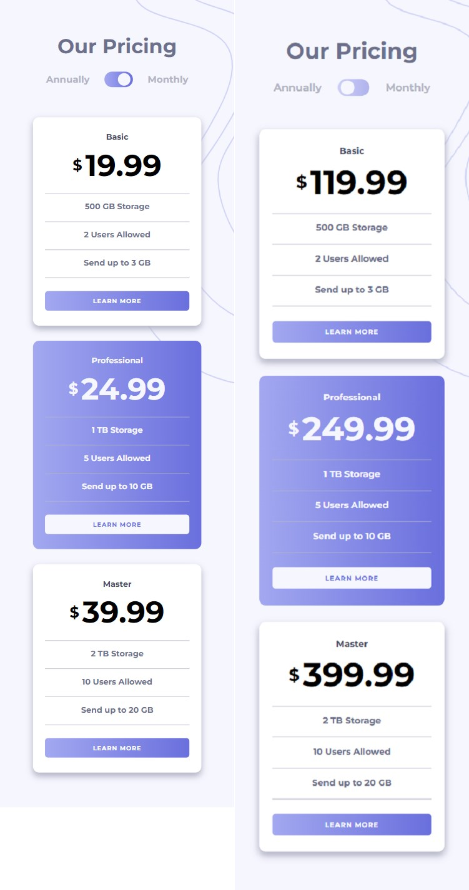
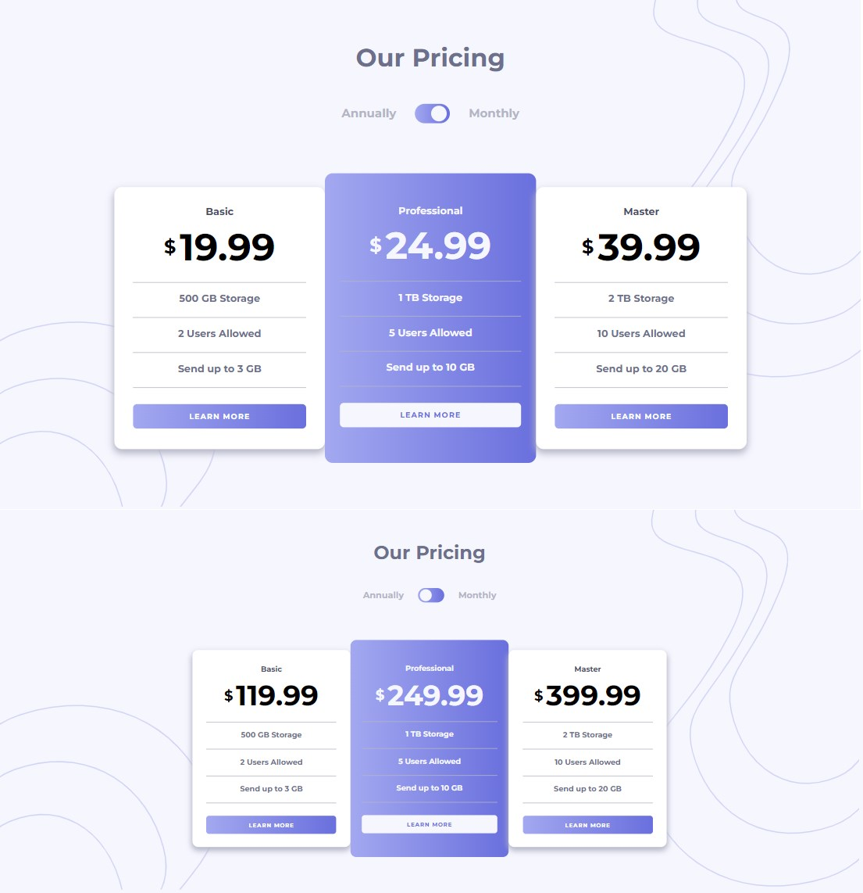
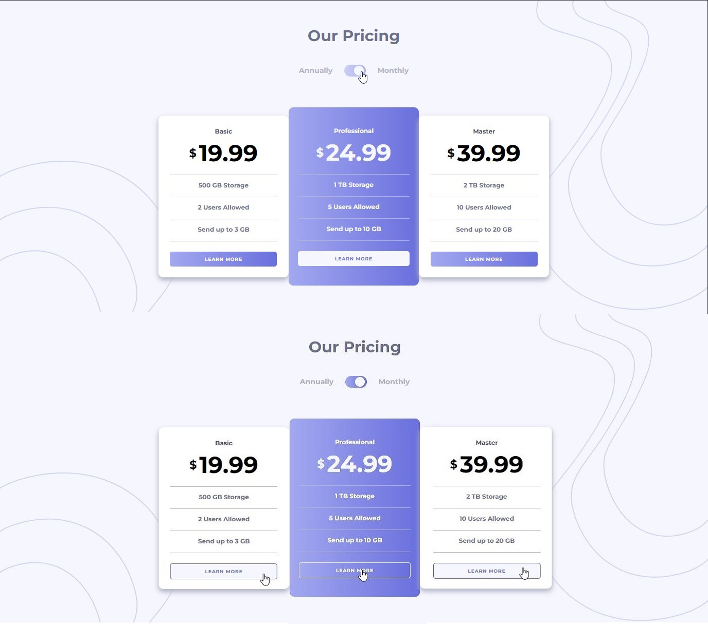

# Frontend Mentor - Pricing component with toggle solution

This is a solution to the [Pricing component with toggle challenge on Frontend Mentor](https://www.frontendmentor.io/challenges/pricing-component-with-toggle-8vPwRMIC). Frontend Mentor challenges help you improve your coding skills by building realistic projects. 

## Table of contents

- [Overview](#overview)
  - [The challenge](#the-challenge)
  - [Screenshot](#screenshot)
  - [Links](#links)
- [My process](#my-process)
  - [Built with](#built-with)
  - [What I learned](#what-i-learned)
  - [Useful resources](#useful-resources)
- [Author](#author)


## Overview


### The challenge

Users should be able to:

- View the optimal layout for the component depending on their device's screen size
- Control the toggle with both their mouse/trackpad and their keyboard
- **Bonus**: Complete the challenge with just HTML and CSS

### Screenshot

- Mobile:


- Laptop:


- Active states:


### Links

- Solution URL: [Frontend Mentors](https://your-solution-url.com)
- Live Site URL: [Github](https://amrmabdelazeem.github.io/pricing-component-with-toggle/)

## My process
- Setup local environment for the project.
- Create the HTML structure with semantic HTML tags, including sections for each pricing tier and the toggle button for plans.
- Apply styles to the HTML elements, ensuring a visually appealing layout and responsiveness. Use CSS to hide the details of the toggled sections initially.
- Write JavaScript code to handle the toggle functionality. With the help of jQuery to detect when a user clicks on a toggle button, and dynamically show or hide the corresponding details.
- Use media queries for different devices to ensure responsive design.
- Start deploying to live.


### Built with

- Semantic HTML5 markup
- CSS custom properties
- Flexbox
- CSS Grid
- Mobile-first workflow
- Media Queries
- Javascript
- Jquery
- DOM


### What I learned

I used two background images in the same time and managed to resize and align both differently:

```css
body{
    background-image: url("../images/bg-top.svg"), url("../images/bg-bottom.svg");
    background-size: 25%, 25%;
    background-position: top right, bottom left;
}
```

### Useful resources

- [Example resource 1](https://api.jquery.com/) - The documentation for jQuery.

## Author

- Website - [Github](https://github.com/amrmabdelazeem)
- Frontend Mentor - [@amrmabdelazeem](https://www.frontendmentor.io/profile/amrmabdelazeem)